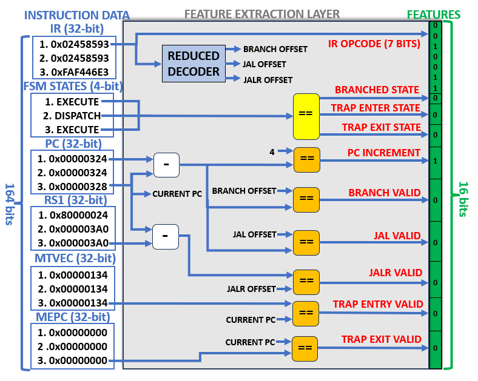

# Methodology

There were 8 stages to develop the smart watchdog, as shown below.

  

## **Stage 1 - Data Collection**:

A custom hardware framework was developed to inject faults into RISC-V core and extract instruction data to text files, creating a library of instructions executed normally and with control flow errors occuring. (Hardware architecture will be discussed in a future publication).

Every clock cycle of execution in Neorv32, six data points are extracted:

* **Instruction Register (IR):** Defines the type of instruction being executed.
* **Program Counter Register (PC):** Holds the memory address of the instruction being executed.
* **FSM Execute Engine States:** Internal CPU states (instruction dispatch, execute, branched, trap entry etc).
* **Source Register 1 (RS1):** Source register 1 used in instructions (can hold addresses for computation).
* **Machine Trap Base Address Register (MTVEC):** Holds the base address of the trap handler (trap entry point).
* **Machine Exception Program Counter (MEPC):** Holds the return address from the trap handler (trap exit point).

Totals 164 bits of parallel input to the smart watchdog.

## **Stage 2 - Feature Extraction**:

These six data signals combined provide information on control flow in the RISC-V architecture. To allow for changes in program code (e.g. different instruction sequences), and to reduce input data width to the SNN, features are extracted as shown below. The 164 bits are condensed down to just 16 binary features, with each feature capturing a single piece of information relating to the current instruction.

  

## **Stage 3 - Dataset Preprocessing**:

The feature layer is implemented in software (Python script)....

## **Stage 4 - SNN Model Design**:

dfafagdg

## **Stage 5 - SNN Model Training**:

dfafagdg

## **Stage 6 - SNN Model Testing**:

dfafagdg

## **Stage 7 - Smart Watchdog Implementation**:

dfafagdg

## **Stage 8 - Smart Watchdog Validation**:

dfafagdg
