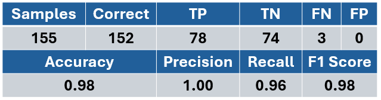

# Methodology

IS THIS OK TO INCLUDE AS IT IS FROM PAPER (IEEE COPYRIGHT ETC)?

There were 8 stages to develop the smart watchdog, as shown below. This information can also be found in the main paper.

  

## **Stage 1 - Data Collection**:

A custom hardware framework was developed to inject faults into RISC-V core and extract instruction data to text files, creating a library of instructions executed normally and with control flow errors occuring. (Hardware architecture will be discussed in a future publication).

Three different software applications were executed on Neorv32:
* **Fibonacci Series - generates first 45 numbers.**
* **Bubble Sort - sorts 25 numbers.**
* **Matrix Multiplication - multiplies a 4x4 matrix**

Every clock cycle of execution in Neorv32, six data points are extracted:

* **Instruction Register (IR):** Defines the type of instruction being executed.
* **Program Counter Register (PC):** Holds the memory address of the instruction being executed.
* **FSM Execute Engine States:** Internal CPU states (instruction dispatch, execute, branched, trap entry etc).
* **Source Register 1 (RS1):** Source register 1 used in instructions (can hold addresses for computation).
* **Machine Trap Base Address Register (MTVEC):** Holds the base address of the trap handler (trap entry point).
* **Machine Exception Program Counter (MEPC):** Holds the return address from the trap handler (trap exit point).

Totals 164 bits of parallel input to the smart watchdog.

## **Stage 2 - Feature Extraction**:

These six data signals combined provide information on control flow in the RISC-V architecture. To allow for changes in program code (e.g. different instruction sequences), and to reduce input data width to the SNN, features are extracted as shown below. The 164 bits are condensed down to just 16 binary features, with each feature capturing a single piece of information relating to the current instruction. The goal is to train the SNN model to distinguish between normal execution and control flow errors.

  

## **Stage 3 - Dataset Preprocessing**:

The data collection stage gathered around 6.7 million instructions from the RISC-V (Neorv32). As the name implies, there are a reduced number of instructions in the base RISC-V architecture. The data for each instruction in the text files from data collection is passed through feature layer (Python script), creating a binary feature dataset for each of the three applications. As many of the instructions produce the same features, only unique feature samples are appended to the dataset.

  

The binary feature datasets for each application are shown below. Fibonacci Series datset is used to train the SNN and a combined dataset from the Bubble Sort and Matrix Multiplication is used to test the SNN model. As the testing dataset is larger, there will be unseen data samples for a fair evaluation of the developed model.

  

## **Stage 4 - SNN Model Design**:

Key design choices for the SNN model are shown below. The SNN will take the 16 binary features directly as inputs. The input layer acts as a spike encoding with a custom rate-based enconding scheme:

Logic 0 feature - 2 spikes
Logic 1 feature - 8 spikes

The SNN will be stimulated for just 10 timesteps to keep inference quick.

Network size is 16 inputs and hidden and output layers of 20 and 2 leaky-integrate and fire neurons respectively. 

Output layer decoding simply takes the highest sspike count neuron as the class winner for the inference.

  

## **Stage 5 - SNN Model Training**:

The table below shows the key parameters of the training algorithm using SNNtorch. The Fibonacci Series application is the training dataset.

  

## **Stage 6 - SNN Model Testing**:

The table below shows the testing  using SNNtorch. The combined dataset from the Bubble Sort and Matrix Multiplication applications is the testing dataset.

  

It is important to note that out of these 155 test samples, 80 were **seen** in the Fibonacci Series dataset during training. The SNN model classified these correctly. More importantly the remaining 75 samples in the test dataset were **unseen** during training to which the SNN classified 72 correctly (96% accuracy on unseen data).

## **Stage 7 - Smart Watchdog Implementation**:

The smart watchdog was implemented in VHDL on an AMD FPGA using Vivado IDE. A block digram below shows the architecture. Every clock cycle, the six data signals from Neorv32 are buffered in a FIFO. A minimal control FSM handles reading the data from the FIFO to the feature layer. Upon an instruction being complete, the 16 features are passed as input to the SNN and the control FSM triggers the SNN. This process repeats while there is data in the FIFO (i.e. not empty).

  

The table below presents the hardware synthesis results, which are discussed in the main paper. The smart watchdog component currently has a maximum frequency of 350MHz and has a latency of 153 clock cycles, allowing inference to take under 438ns.

  

## **Stage 8 - Smart Watchdog Validation**:

The final stage involves hardware validation. A new Heap Sort application was compiled and executed on Neorv32 while faults were injected. The features and SNN class results of each instruction is extracted off FPGA to be analysed in Python. The table below presents the validation results.

The smart watchdog classified around 2.4 million instructions in real time on FPGA. Following the same dataset preprocessing process as the other applications, there were 100 unique features samples from the Heap Sort application. There were 11 new samples that appeared from the Heap Sort application that were not seen during training or testing previously. The smart watchdog classified all 11 of these correctly (a further 100% accuracy on unseen data).

  

RISC-V processors have a trap handler software routine for handling interrupts and exceptions (i.e. faulty conditions). Some control flow errors resulted in traps being triggered in Neorv32 while others are not identified. Unidentified control flow errors can be dangerous and result in silent data corruption. The table below shows the fault detection capability of the smart watchdog in the errors that went undetected by the RISC-V processor.

  

[Return back](../README.md#Smart-Watchdog-Live-Demonstration-)
