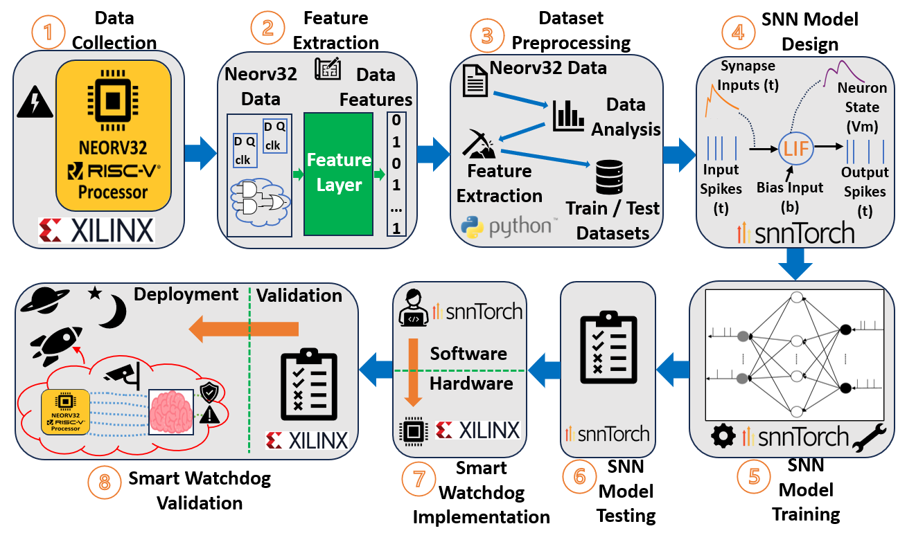

# Methodology

There were 8 stages to develop the smart watchdog, as shown below. **Include diagram**

**Stage 1 - Data Collection** : A custom hardware framework was developed to inject faults into RISC-V core and extract instruction data to text files, creating a library of instructions executed normally and with control flow errors occuring. (Hardware architecture will be discussed in a future publication).

Every clock cycle of execute in Neorv32, six data points are extracted:

* Instruction Register (IR): Defines the type of instruction being executed.
* Program Counter Register (PC): Holds the memory address of the instruction being executed.
* FSM Execute Engine States: Internal CPU states (instruction dispatch, execute, branched, trap entry etc).
* Source Register 1 (RS1): Source register 1 used in instructions (can hold addresses for computation).
* Machine Trap Base Address Register (MTVEC): Holds the base address of the trap handler (trap entry point).
* Machine Exception Program Counter (MEPC): Holds the return address from the trap handler (trap exit point).

**Stage 2 - Feature Extraction** : dfafagdg

**Stage 3 - Dataset Preprocessing** : dfafagdg

**Stage 4 - SNN Model Design** : dfafagdg

**Stage 5 - SNN Model Training** : dfafagdg

**Stage 6 - SNN Model Testing** : dfafagdg

**Stage 7 - Smart Watchdog Implementation** : dfafagdg

**Stage 8 - Smart Watchdog Validation** : dfafagdg
