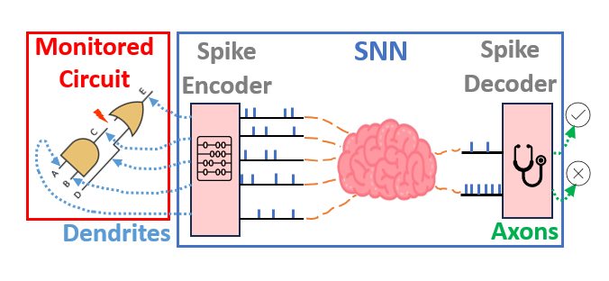
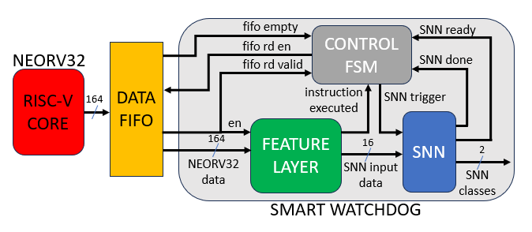
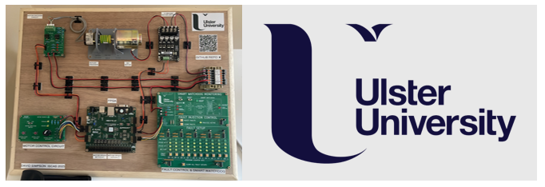
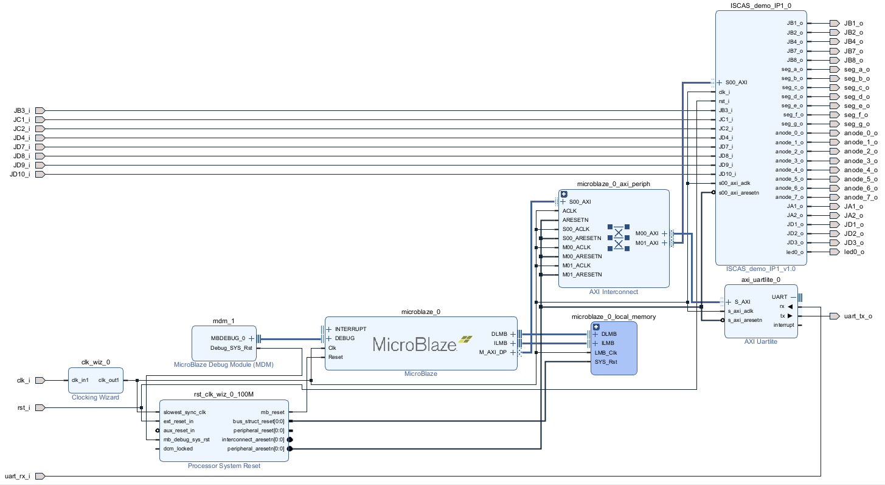

# ISCAS 2025 Live Demonstration: Smart Watchdog Mechanism for Real time Fault Detection in RISC-V

This live demonstration relates to our paper titled “Smart Watchdog Mechanism for Fault Detection in RISC-V” also presented at ISCAS 2025.

 David Simpson - PhD researcher at [Ulster University - School of Computing, Engineering and Intelligent Systems]( https://www.ulster.ac.uk/faculties/computing-engineering-and-the-built-environment/computing-engineering-intelligent-systems)
 
# Summary 👀

In this paper we developed a novel, smarter watchdog paradigm for RISC-V processors capable of detecting hardware faults (control flow errors) in real time. Inspired by how the human brain can perform complex computation both efficiently and reliably, we leverage Spiking Neural Networks (SNNs) as the critical decision-making element with the objective of realising a more dependable and hardware friendly watchdog architecture.

  

This appears to be first instance of SNNs being used as a watchdog to detect faults/errors in a processor architecture. This repository is created to support the live demonstration at ISCAS 2025, showcasing the smart watchdog deployed on FPGA hardware monitoring a RISC-V softcore (Neorv32) which is running a realisitic motor control task.

# Background ⁉️

## What is a Control Flow Error?

When a software program is written for an embedded processor (e.g. C, or assembly), compilation tools convert this high level code into a sequence of instructions. The CPU then fetches instructions dynamically to execute the program algorithm. Transient faults such as Single Event Upsets (SEUs) can corrupt this sequence of instructions executed, causing the processor to deviate away from the correct program flow. This is known as a Control Flow Error (CFE).

## What is a Smart Watchdog? 

A watchdog is an independant hardware component that monitors the execution of a program during runtime, and can detect when CFEs occur in a processor. We call this a smart watchdog as it leverages a brain-like circuit (SNN) for making decisions on the program execution based on an offline training process. The diagram below shows the smart watchdog implemented in hardware with the RISC-V processor [(Neorv32).](https://github.com/stnolting/neorv32)

  

The 8-stage methodology for developing this smart watchdog can be found [here](/Methodology/README.md).

# Smart Watchdog Live Demonstration 🚀

This live demonstration deploys the developed smart watchdog model on FPGA to monitor program execution of the RISC-V processor (Neorv32).

Check out a video of the smart watchdog monitoring the RISC-V processor in real time: [Live Demo Video](https://youtu.be/D4o1u4qUvNw)

## Demonstration Overview

* A [basic PI-speed control algorithmn](/RISC-V%20Code/) written in C is compiled and executed on Neorv32, resembling a safety-critical motor control task.
* The speed and direction of the motor can be controlled while faults are injected into the program counter register of Neorv32 where control flow errors might manifest.
* The smart watchdog monitors each instruction executed by Neorv32 and classifies accordingly, i.e. normal program execution or control flow error detected.
* Smart watchdog class decisions and other information is extracted off FPGA over UART to a Python GUI for displaying to the demo attendees.

## Demonstration Setup

The demonstration setup is shown below. There are 2 main parts of the setup:

* A hardware design consisting of a motor, rotary encoder, custom PCBs and a Digilent FPGA development board (AMD Artix-7 FPGA).
* A software Python-based GUI running on a Dell laptop (located under the wooden board) and displayed on a monitor.

To view the PCBs created for this live demo in more detail: [PCBs](/PCBs/).

  

All custom FPGA hardware is packaged inside an IP block (ISCAS_demo_IP1) with an AXI interface, as shown in the block diagram below. A Microblaze communicates with the custom IP through the AXI interface and with the Python GUI over UART. 

  

# Contact

Feel free to reach out:

Email: simpson-d12@ulster.ac.uk

LinkedIn: https://www.linkedin.com/in/david-simpson-040189221/

# Acknowledgements

Department for the Economy (DfE) PhD scholarship.

Thanks to Stephan Nolting for sharing his experstise on RISC-V and in particular, Neorv32.

## License and Usage

This repository contains supplementary material for our ISCAS 2025 papers, including summaries and a demo. Any code is provided strictly for academic viewing and reference purposes. It is not licensed for reuse, redistribution, or modification, as of yet.

© 2025 IEEE. All rights reserved. IEEE retains copyright ownership of the published papers.

# Citation

#### Main Paper:

D. Simpson, J. Harkin, M. McElholm and L. McDaid, "Smart Watchdog Mechanism for Fault Detection in RISC-V," 2025 IEEE International Symposium on Circuits and Systems (ISCAS), London, United Kingdom, 2025, pp. 1-5, doi: 10.1109/ISCAS56072.2025.11044018.

#### Live Demo Paper:

D. Simpson, J. Harkin, M. McElholm and L. McDaid, "Live Demonstration: Smart Watchdog Mechanism for Real-time Fault Detection in RISC-V," 2025 IEEE International Symposium on Circuits and Systems (ISCAS), London, United Kingdom, 2025, pp. 1-1, doi: 10.1109/ISCAS56072.2025.11044164.
