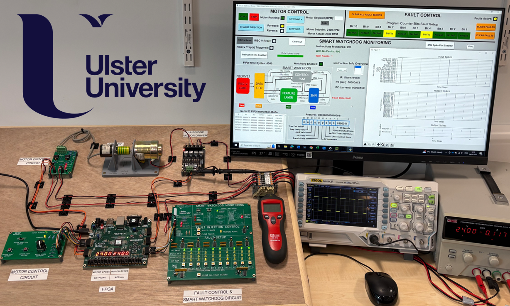

  

# ISCAS 2025 Live Demonstration: Smart Watchdog Mechanism for Real time Fault Detection in RISC-V

)

This live demonstration relates to our paper titled “Smart Watchdog Mechanism for Fault Detection in RISC-V” also presented at ISCAS 2025.

Links to IEEE papers will be available soon!

# Summary 👀

In this paper we developed a novel, smarter watchdog paradigm for RISC-V processors capable of detecting hardware faults (control flow errors) in real time. Inspired by how the human brain can perform complex computation both efficiently and reliably, we leverage Spiking Neural Networks (SNNs) as the critical decision-making element with the objective of realising a more dependable and hardware friendly watchdog architecture.

  

This appears to be first instance of SNNs being used as a watchdog to detect faults/errors in a processor architecture. This repository is created to support the live demonstration at ISCAS 2025, showcasing the smart watchdog deployed on FPGA hardware monitoring a RISC-V softcore (Neorv32) which is running a realisitic motor control task.

# Background ⁉️

## What is a Control Flow Error?

When a software program is written for an embedded processors (e.g. C, or assembly), compliation toolchains convert this high level code into a sequence of instructions. The CPU then fetches instructions dynamically to execute the program algorithm. Transient faults such as Single Event Upsets (SEUs) can corrupt this sequence of instruction executed, causing the processor to deviate away from the correct program flow. This is known as a Control Flow Error (CFE).

## What is a Smart Watchdog? 

A watchdog is an independant hardware component that monitors the execution of a software program during runtime, and can detect when CFEs occur. We call this a smart watchdog as it uses a brain-like circuit (SNN) that can make decisions on the execution of a program based on an offline training process. The diagram below shows the smart watchdog implemented in hardware with the RISC-V processor (Neorv32).

  

The 8-stage methodology for developing this smart watchdog can be found [here](/Methodology/README.md).

# Smart Watchdog Live Demonstration 🚀

This live demonstration deploys the developed smart watchdog model on FPGA to monitor program execution in real time of the RISC-V processor (Neorv32).

## Overview

* A [basic PI-speed control algorithmn](/RISC-V%20Code/) written in C is compiled and executed on Neorv32, resembling a safety-critical motor control task.
* The speed and direction of the motor can be controlled while faults are injected into the program counter register of Neorv32 where control flow errors might manifest.
* The smart watchdog monitors each instruction executed by Neorv32 and classifies accordingly, i.e. normal program execution or control flow error detected.
* Smart watchdog class decisions and other information is extracted off FPGA over UART to a Python GUI for displaying to the demo attendees.

## Demonstration Setup

The demonstration setup is shown below.

IMAGE OF DEMO SETUP (HARDWARE + GUI ETC)

## Motor Control Task

- Overview of application
- Description of hardware setup
- animations?

  

## Hardware Details

## Video of Smart Watchdog Live Demonstration

Check out a video of the smart watchdog and RISC-V in action: [Live Demo Video](/link)

# Contact

Feel free to reach out with any questions:

Email: simpson-d12@ulster.ac.uk

LinkedIn: https://www.linkedin.com/in/david-simpson-040189221/

# PhD Supervisors

Ulster University - School of Computing, Engineering and Intelligent Systems, Magee campus

(UNI LOGO)

Professor Jim Harkin, Mr Malachy McElholm, Professor Liam McDaid

# Disclaimer

This page contains supplementary material for our ISCAS 2025 papers.

© 2025 IEEE. This content is provided for academic purposes only.

# Citation

Citation details to come.
